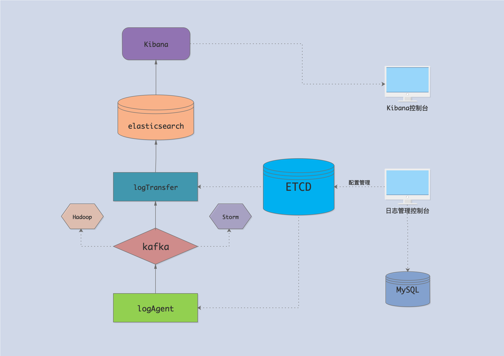
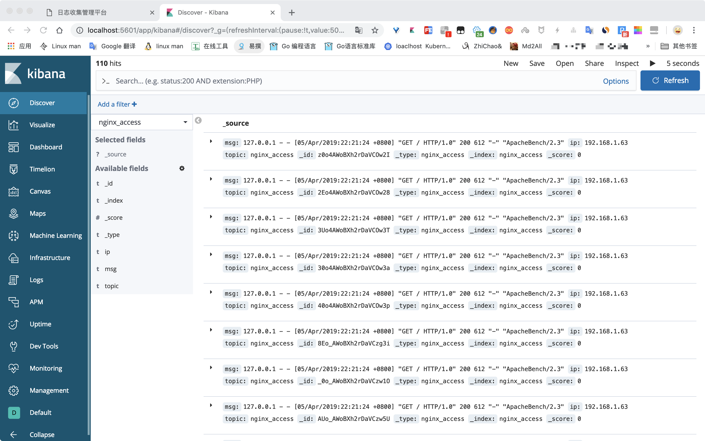
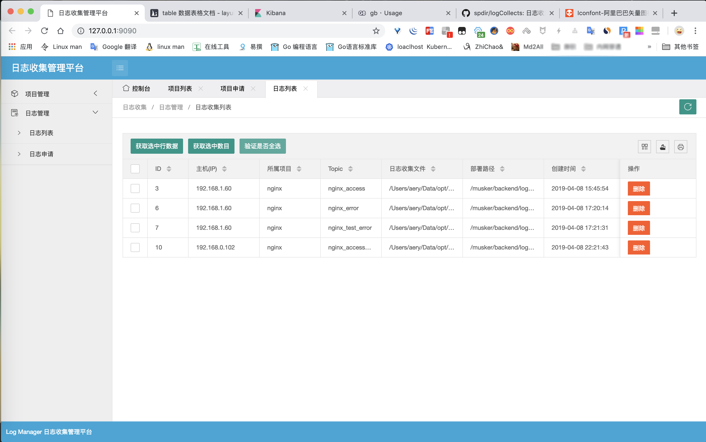

# 轻量级、动态管理日志收集客户端

## 介绍
logCollect是一个轻量级，可动态管理的日志收集客户端。所有的日志收集任务都通过日志收集管理端进行配置管理。

### 架构图


### kibana截图


## 模块划分
### logAgent
日志收集模块，负责收集日志并发送到kafka。

目录结构：

```
logAgent
├── agent  // main
│   ├── config.go
│   ├── etcd.go
│   ├── getip.go
│   ├── log.go
│   ├── main.go
│   └── server.go
├── config  // 配置文件
│   └── logagent.ini
├── kafka  // kakfa模块
│   └── producer.go
├── logs   // logagent程序日志
│   └── logagent.log
└── tailf   // tailf模块
    └── tailf.go
```

### logTransfer
日志传输模块，负责将kafka中的消息发送到elesticsearch。

目录结构:

```
logTransfer
├── config  // 配置文件
│   └── logTransger.ini
├── elasticsearch  // elasticsearch模块
│   └── elastic.go
├── kafka  // kafka模块
│   └── consumer.go
├── logs  // logtransfer程序日志
│   └── logtransfer.log
└── transfer  // main
    ├── config.go
    ├── etcd.go
    ├── log.go
    ├── main.go
    └── server.go
```

### logManager
日志收集管理端，负责项目和日志收集任务的管理。

截图:



目录结构:

```
logManager
├── conf  // 配置文件
│   └── app.conf
├── controllers  // mvc-> controllers模块
│   ├── index.go
│   ├── log.go
│   └── project.go
├── data  // 存放数据文件
│   └── logmanager.sql  //mysql数据库表结构
├── logs   // 程序日志文件
│   └── logmanager.log
├── manager  // main
│   ├── log.go
│   └── main.go
├── models  // mvc-> models模块
│   ├── log.go
│   ├── model.go
│   └── project.go
├── routers // 路由模块
│   └── router.go
├── static  // 静态文件
│   ├── css
│   ├── fonts
│   ├── images
│   ├── js
│   └── lib
│       └── layui //layui框架
└── views  // mvc-> views文件
    ├── app
    ├── layout
    ├── log
    └── project
```

## 技术栈
+  Go
+  ETCD
+  kafka
+  MySQL
+  elasticsearch
+  kibana
+  Beego
+  layui
+  zookeeper

## 使用

> 以下使用均在linux amd64位系统

### 1.安装依赖软件服务
1. ETCD
2. kafka
3. MySQL
4. elasticsearch
5. kibana
6. zookeeper

安装以上软件，可以为单机模式或者为集群模式

### 2.下载发行版二进制文件

下载地址：[https://github.com/spdir/logCollect/releases](https://github.com/spdir/logCollect/releases)

```bash
$ cd /usr/local/src
$ export logCollectVersion="版本号"
$ tar zxvf logCollect-linux-amd64-${logCollectVersion}.tar.gz
```

### 3.部署logManager管理

```bash
1. $ cd logCollect-linux-amd64-${logCollectVersion}/logManager
2. 创建数据库，并将`data/logmanager.sql`文件导入到数据库中
2. 配置logManager配置文件，文件路径`conf/app.conf`
3. 启动logManager
   $ ./logmanager &> /dev/null &
```

### 4.部署logAgent日志收集客户端

```bash
1. $ cd logCollect-linux-amd64-${logCollectVersion}/logAgent
2. 配置logAgent配置文件，文件路径`config/logagent.ini`
3. 启动logAgent
   $ ./logagent config/logagent.ini &> /dev/null &
```

### 5.部署logTransfer日志传输

```bash
1. $ cd logCollect-linux-amd64-${logCollectVersion}/logTransfer
2. 配置logTransfer配置文件，文件路径`config/logagent.ini`
3. 启动logAgent
   $ ./logtransger config/logtransger.ini &> /dev/null &
```

## 编译logCollect Go程序
> 以下操作均在linux系统演示

### 1.安装go编译器
参考网上文章进行安装

### 2.下载发行版源码
下载地址：[https://github.com/spdir/logCollect/releases](https://github.com/spdir/logCollect/releases)

```bash
$ cd /usr/local/src
$ export logCollectVersion="版本号"
$ tar zxvf logCollect-${logCollectVersion}.tar.gz
$ export GOPATH="/usr/local/src/logCollect-${logCollectVersion}"
$ go env    // 确定GOPATH为export声明的值
$ cd /usr/local/src/logCollect-${logCollectVersion}
$ go get   // 获取依赖包
```

### 3.编译logManager管理

```bash
$ cd /usr/local/src/logCollect-${logCollectVersion}/src/logManager
$ go build -o logmanager ./manager
```

### 4.编译logAgent日志收集客户端

```bash
$ cd /usr/local/src/logCollect-${logCollectVersion}/src/logAgent
$ go build -o logagent ./agent
```


### 5.编译logTransfer日志传输

```bash
$ cd /usr/local/src/logCollect-${logCollectVersion}/src/logTransfer
$ go build -o logtransfer ./transfer
```
